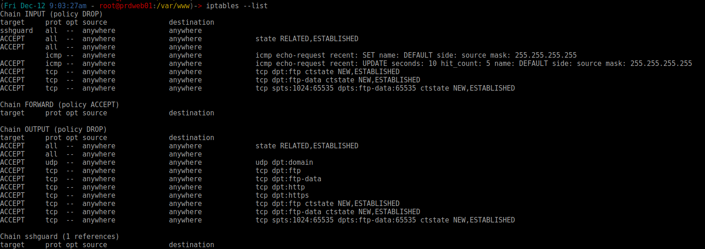
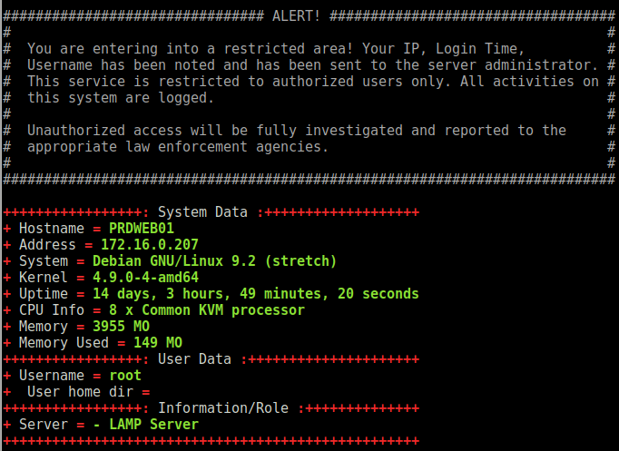
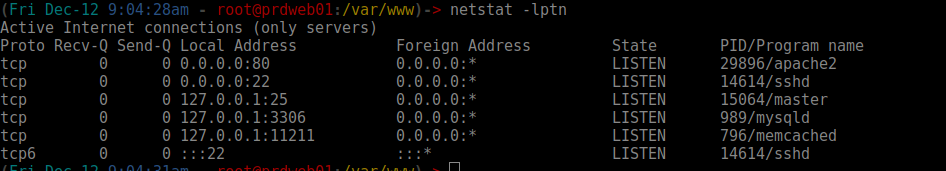

# Ready4Prod

Build your linux LAMP server.

* Author : Tlams
* Date : Nov 2017
* Status: Stable V1.0
* Website: https://www.ready4prod.com/


##### Stack available:
* Basic LAMP
* Advanced LAMP

### Features

#### Base
* Upgrade VM
* Hostname
* Hosts files
* SSH host key
* DNS resolver
* Motd
* Firewall - IPTABLES
* VIM
* Network - IP, GW...
* SSH Server
* SSH Protection (bruteforce)
* Bashrc
* SMTP Server - Postfix
* Log management (Logrotate, rsyslog)

#### LAMP - Basic
* HTTP Server - Apache2.4
* VHOST - examples
* Database - MariaDB
* PHP7 - Lib Apache Mod

#### LAMP - Advanced
* HTTP Server - Apache2.4
* VHOST - examples
* Database - MariaDB
* PHP7 - FPM (Single base pool example)
* HTTP Cache - Varnish
* SSL Reverse - Hitch
* SSL generation - LetsEncrypt

###### Nexts features / bug patch
* Improve MariaDB config
* Improve Apache config
* Improve PHP7 config

## Quick start

### Limitations
* Do not use on a existent server in production !

### Requirement:
* Linux (Debian 9) server, with full root access
* Python with fabric (http://www.fabfile.org/)


### Clone repository on your desktop:
``` bash
git clone git@github.com:ThomasGsp/Ready4Prod.git
```

### Edit/configure with yours settings:
``` bash

vi install_packages.py
    (....)
    # Composants list:
    # You have the possibility to select specifics composants
    # UPGRADE, HOSTNAME, SSHHOSTKEY, DNS, USERBASHRC,
    # NETWORK, MOTD ,FW ( Firewall), VIM (Vim configuration)
    # SSH (sshd + sshguard), SMTP (postfix conf), LOGS, USERS
    # MUST BE A LIST

    BASE = [
        "UPGRADE", "HOSTNAME",
        "SSHHOSTKEY", "DNS",
        "USERBASHRC", "NETWORK",
        "MOTD", "FW",
        "VIM", "SSH",
        "SMTP", "LOGS",
        "USERS"
    ]

    # Select lamp type (or keep empty for none installation)
    # LAMP_BASE (Apache, mariadb, phpmod)  OR
    # LAMP_AVANCED (Apache, mariadb, php-fpm, ssl, varnish)
    # MUST BE A LIST
    LAMP = ["LAMP_ADVANCED"]

    SOFT = [
        "VHOSTS", "VARNISH",
        "APACHE", "PHP",
        "HITCH", "SSL"
    ]


    # VHOSTS configuration
    #  MUST BE A DICT
    VHOSTS = \
        [
            {
                # Main domain name
                "SERVER_NAME": "sitedemo.com",
                # Secondary domain name
                "SERVER_NAME_ALIAS": ["www.sitedemo.com", "www.sitedemo.fr"],
                # File for this domain ( zip, tar, tar.gz, tar.bz2, direct files)
                "FILES": "/data/sitedemo.com/index.html",
            },
            {
                "SERVER_NAME": "sitedemo1.com",
                "SERVER_NAME_ALIAS": ["www.sitedemo1.com", "www.sitedemo1.fr"],
                "FILES": "/data/sitedemo1.com/startbootstrap-resume-gh-pages.zip"
            }
        ]

    # DNS Servers
    # MUST BE A LIST
    NETWORK_DNS = ["208.67.222.222", "8.8.8.8"]

    # VM HOSTNAME
    # MUST BE A STRING
    HOSTNAME = "prdweb01"

    # SSH PORT
    # MUST BE A STRING
    PORT_SSH_NUMBER = "22"

    # GENERAL WHITELIST IP (SSH, FIREWALL, SOFT...)
    # MUST BE A LIST
    WHITELITSTIPS = ["192.168.1.1", "172.16.10.5", "127.0.0.1"]

    # NETWORK configuration
    # MUST BE A STRING
    CONF_INTERFACES = {}
    CONF_INTERFACES["NETWORK_IP"] = "172.16.0.207"
    CONF_INTERFACES["NETWORK_MASK"] = "255.255.255.0"
    CONF_INTERFACES["NETWORK_GW"] = "172.16.0.254"
    CONF_INTERFACES["mode"] = "static"
    # getinsterfacesname() = Autoselection OR interface name
    CONF_INTERFACES["DEVISE"] = getinsterfacesname()

    # USERS configuration
    # MUST BE DICT
    USERS = \
        [
            {
                "USER": "prod",
                "PASSWORD": "afinDLMLzef55fds", # CLEAR PW
                "KEY": [""]     # Public Key (LIST)
            }
    ]

    # Mysql users and databases configurations
    MYSQL_CONF = \
        [
            {
                "username": "produser",
                "password": "qzf5gr2", # CLEAR PW
                "database": "prodbase"
            }
        ]

    (....)

```

### Play Fabric's file:
``` bash
fab -f install_packages.py deploy_base_lamp -H <ip_srv>
```


### Results:
#### bashrc 

#### iptables rules 

#### motd

#### netstat (base lamp)



##### External sources:
* bashrc : http://mindnugget.com/bashrc/.bashrc
* motd www.tomzone.fr/creation-dun-motd-dynamique/
* awk script for network configuration https://github.com/JoeKuan/Network-Interfaces-Script
